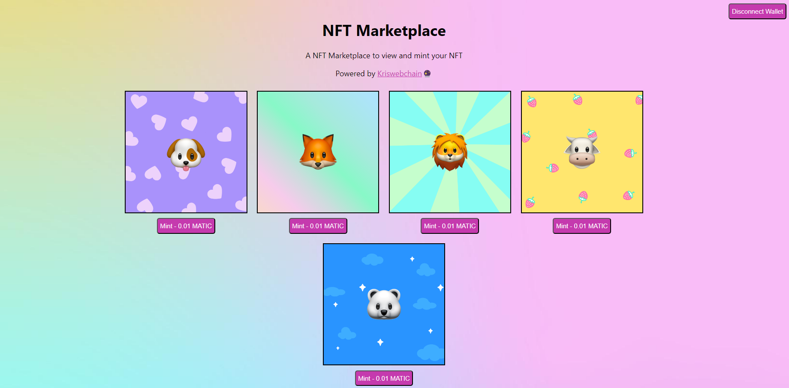

## CryptoPuppies NFT Marketplace Project

A decentralized NFT marketplace built on the Ethereum blockchain using Hardhat, Ethers.js, React, and Solidity.

## Project Overview

CryptoPuppies is an NFT marketplace where users can mint, buy, and sell unique digital puppies. The marketplace is built on the Ethereum blockchain, ensuring a secure and transparent experience for all users.

### Features

- Mint unique digital puppies as NFTs
- Buy and sell NFTs on the marketplace
- View and manage your NFT collection
- Connect to the marketplace using MetaMask

### Technical Details

- **Blockchain:** Ethereum
- **Smart Contract Language:** Solidity
- **Development Framework:** Hardhat
- **Frontend Framework:** React
- **Library:** Ethers.js
- **Wallet Integration:** MetaMask

### Prerequisites

- Node.js (>=14.17.0)
- npm (>=6.14.13)
- Hardhat (>=2.6.4)
- Ethers.js (>=5.5.1)
- React (>=17.0.2)
- MetaMask browser extension

### Installation

1. Clone the repository: `git clone https://github.com/Kris291099/cryptopuppies-nft-marketplace.git`
2. Install dependencies: `npm install`
3. Compile the smart contract: `npx hardhat compile`
4. Deploy the smart contract to the Ethereum network: `npx hardhat run scripts/deploy.js`
5. Start the React app: `npm start`

### Usage

1. Connect to the marketplace using MetaMask
2. Mint a new NFT by clicking the "Mint" button
3. View your NFT collection by clicking the "My Collection" button
4. Buy and sell NFTs on the marketplace

### Smart Contract

The smart contract is deployed on the Ethereum network and can be viewed on Etherscan.

- **Contract Address:** [insert contract address]
- **Contract ABI:** [insert contract ABI]

### Contributing

Contributions are welcome! Please submit a pull request with your changes and a brief description of what you've added or fixed.

### License

This project is licensed under the MIT License.

### Acknowledgments

- Hardhat for providing a robust development framework
- Ethers.js for providing a simple and intuitive library for interacting with the Ethereum blockchain
- React for providing a powerful frontend framework
- MetaMask for providing a seamless wallet integration experience
